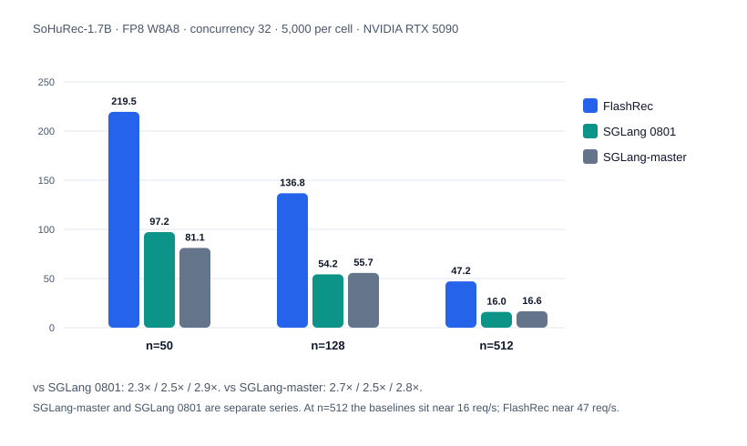
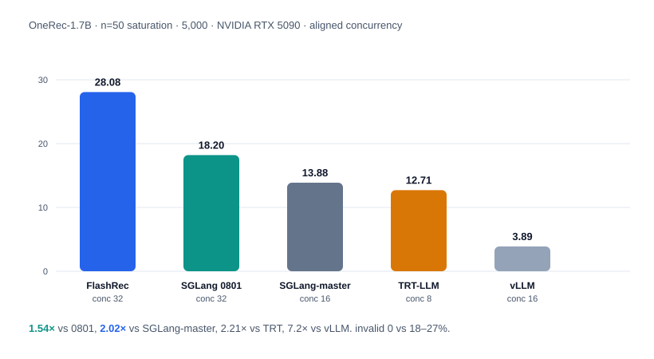

<div align="center">
  

  <p>
    <a href="LICENSE"></a>
    <a href="pyproject.toml"></a>
    <a href="#quickstart"></a>
    <a href="https://github.com/sohu-mptc/FlashRec/actions/workflows/ci.yml"></a>
  </p>

  <p>
    <a href="#features"><b>Features</b></a> |
    <a href="#quickstart"><b>Quickstart</b></a> |
    <a href="docs/README.md"><b>Documentation</b></a> |
    <a href="examples/"><b>Examples</b></a> |
    <a href="docs/architecture.md"><b>Architecture</b></a> |
    <a href="docs/api.md"><b>API</b></a> |
    <a href="docs/baselines.md"><b>Evaluation</b></a> |
    <a href="docs/faq.md"><b>FAQ</b></a> |
    <a href="README.zh-CN.md"><b>简体中文</b></a>
  </p>

  <p><b>An inference engine for generative recommendation, based on mini-sglang:<br/>
  wide beam search over a semantic-ID catalog, executed inside CUDA graphs.</b></p>
</div>

---

Generative recommendation (GenRec) formulates item retrieval as the generation
of semantic IDs (SIDs): short, fixed-depth token sequences that index an item
catalog. A typical request decodes 3–5 steps at a beam width of 50–512 or more,
with every continuation restricted to the valid-SID catalog. General-purpose LLM
engines are optimized for long-sequence, single-path decoding; a wide-beam
request occupies the engine, and throughput does not scale with concurrency.
FlashRec is designed for this workload.

<div align="center">
  
</div>
<div align="center">
  
</div>

## Features

The engine targets short SID depth, wide beam, and catalog-constrained decoding.
Throughput scales with beam width `n` and concurrency; the illegal-SID rate is
0 under the trie constraint. Measurements are in [Evaluation](#evaluation).

| | FlashRec | General LLM engines |
| --- | --- | --- |
| Depth / width | 3–5 steps × 50–512+ beams | hundreds–thousands of steps × 1 sequence |
| Vocabulary | valid-SID continuations (trie) | full, unconstrained |
| Wide-beam graphs | including expansion, captured at multiples of `n`, one replay | capture often sized for decode batch; wide beam runs eager |
| Illegal SIDs | **0** | ~17–27%, filtered after the fact |
| Concurrency | beam-row slot budget; rows from different requests share a step | one wide-beam request occupies the engine; throughput roughly flat |

**Decoding**

- **CUDA graphs.** Beam widths from 50 to 512+ run in captured graphs, including
  the beam-expansion step. Capture sizes extend to multiples of the configured
  width, so a wide beam is a single graph replay.
- **SID constraint.** A fused CUDA kernel (dense or CSR-sparse trie) restricts
  decoding to a catalog of valid semantic IDs. `lm_head` is evaluated only over
  the SID token range. Illegal SIDs are never candidates, so `invalid_rate` is
  0; open-vocabulary baselines leave ~17–27% of beams illegal.
- **Scheduling.** Requests are admitted into decode waves between steps under a
  beam-row slot budget, so beam rows from different requests share a step. A
  radix prefix KV cache with longest-prefix-match scheduling reduces the cost of
  shared prompts; aging prevents starvation.

**Serving**

- **In-process serving.** HTTP, scheduling, weights, and the KV pool share one
  process and one address space.
- **FP8 by default.** W8A8 per-channel weights and `fp8_e4m3` KV, with fused
  RMSNorm→FP8, SiLU→FP8, and QK-RoPE+KV-write. On 1.7B-class checkpoints at
  `n ≤ 128` the main gain is weight and KV-cache footprint; at `n = 512` the two
  precisions converge on throughput, where the step is bound by bookkeeping.
- **API.** Ranked beams on `/v1/chat/completions`. Deterministic top-*k* at
  `temperature = 0`; Gumbel top-*k* without replacement above it.
- **Profiler.** `/start_profile` / `/stop_profile` compatible with
  `sglang.bench_serving --profile`.

## Quickstart

```bash
pip install -e .

# Public GenRec checkpoint used in the documentation.
hf download OpenOneRec/OneRec-1.7B --local-dir ./OneRec-1.7B

# Build the SID catalog from an OpenOneRec RecIF-Bench benchmark_data directory.
DATA_DIR=/path/to/OpenOneRec-RecIF/benchmark_data bash scripts/build_catalog.sh

# Serve, constrained to that catalog. Layout is inferred from the tokenizer.
flashrec --serve --model-path ./OneRec-1.7B --port 8000 \
  --beam-width 32 --max-tokens 5 \
  --sid-vocab-file data/catalogs/sid2pid_beamrec_l4.json
```

```bash
curl -s http://127.0.0.1:8000/v1/chat/completions \
  -H 'Content-Type: application/json' \
  -d '{"messages":[{"role":"user","content":"..."}],
       "n":32,"max_tokens":5,"temperature":0}'
```

Each beam is returned as one `choices[]` entry, ranked best-first, with its
score under `sglext.sequence_score`. With `--sid-vocab-file` the SID layout is
inferred from the checkpoint tokenizer. If the catalog is unset, the engine
decodes over the full vocabulary (connectivity check only). Wide beam
(`n ≥ 512`) also requires `--cuda-graph-max-bs 4096 --batch-slots 4096`.

The server binds `127.0.0.1` and has no authentication. Bind a public address
only on a trusted network or behind an authenticating proxy.

Runnable offline and HTTP clients: [Examples](examples/). Flags:
[Configuration](docs/configuration.md).

## Evaluation

Throughput, retrieval metrics, and HuggingFace codebook overlap were measured on
an **NVIDIA RTX 5090**. See
[Evaluation](docs/baselines.md). Unless noted otherwise, FlashRec runs FP8 with
a SID trie; the baselines are open-vocabulary. **SGLang-master**
([PR #31626](https://github.com/sgl-project/sglang/pull/31626)) and
**SGLang 0801**
([`cswuyg/sglang` `feature/beam_search_update_0801`](https://github.com/cswuyg/sglang/tree/feature/beam_search_update_0801))
are separate engines; do not collapse them into one row.

Evaluation covers:

- **OneRec:** the [OpenOneRec](https://github.com/Kuaishou-OneRec/OpenOneRec)
  RecIF-Bench video task with
  [OneRec-1.7B](https://huggingface.co/OpenOneRec/OneRec-1.7B)
- **SoHuRec-1.7B / SoHuRec-0.6B:** Sohu internal generative-recommendation serving traffic on the corresponding models

Speed-ups are FlashRec relative to that baseline. Do not divide OneRec QPS by
SoHuRec QPS (prompt length differs by about 8×).

| Baseline | Setting | Relative throughput |
| --- | --- | --- |
| **SGLang 0801** | OneRec, `n=50` saturation | **1.54×** (recall@32 0.034 both; invalid 0 vs 0.270) |
| **SGLang-master** | OneRec, `n=50` saturation | **2.02×** (recall@32 0.034 both; invalid 0 vs 0.260) |
| TensorRT-LLM | OneRec, `n=50` saturation | **2.21×** |
| vLLM | OneRec, `n=50` saturation | **7.2×** |
| **SGLang 0801** | SoHuRec-1.7B, `n=50–512` saturation | **2.3–3.0×** |
| **SGLang-master** | SoHuRec-1.7B, `n=50–512` saturation | **2.5–2.9×** |
| **SGLang 0801** | SoHuRec, `n=1000`, concurrency 1 | **2.1–2.2×** (dies at conc ≥ 8) |
| **SGLang-master** | SoHuRec, `n=1000`, concurrency 1 | **2.1–2.2×** (dies at conc ≥ 8) |

On OneRec, FlashRec has `invalid_rate = 0`; open-vocabulary engines leave about
17–27% of beams illegal. The quality gap is **whether SID constraint is on**,
not the engine. **Do not cite FlashRec concurrency-1 recall@32** (unique-beam
collapse). When citing, state the device, trie vs open-vocabulary, concurrency,
and sample count.

### OneRec

[OpenOneRec](https://github.com/Kuaishou-OneRec/OpenOneRec) RecIF-Bench video,
model [OneRec-1.7B](https://huggingface.co/OpenOneRec/OneRec-1.7B). 5,000
samples, `n=50` saturation (highest completed concurrency per engine).

| Engine | Constraint | QPS | conc | recall@32 (conc=8) | invalid |
| --- | --- | ---: | ---: | ---: | ---: |
| **FlashRec** | SID trie | **28.08** | 32 | 0.034 | **0** |
| SGLang 0801 | open-vocab | 18.20 | 32 | 0.034 | 0.270 |
| SGLang-master | open-vocab | 13.88 | 16 | 0.034 | 0.260 |
| TensorRT-LLM | open-vocab | 12.71 | 8 | 0.034 | 0.259 |
| vLLM | open-vocab | 3.89 | 16 | 0.034 | 0.260 |

**1.54×** vs SGLang 0801, **2.02×** vs SGLang-master, **2.21×** vs
TensorRT-LLM, **7.2×** vs vLLM. At `n=1000` FlashRec saturates at **4.62 QPS**;
SGLang-master and SGLang 0801 only hold concurrency 1 (2.5–3.0). Full matrices:
[Evaluation](docs/baselines.md).

On SoHuRec serving prompts: at `n=50`, 1.7B FlashRec saturates at **220 QPS**
and 0.6B at **303 QPS**; at `n=512`, 1.7B FlashRec is **~48 QPS** vs 0801 /
SGLang-master **~16 QPS**; at `n=1000` FlashRec saturates at **24.6 QPS**
(1.7B) and **32 QPS** (0.6B), and SGLang-master and SGLang 0801 only hold concurrency 1.

### Numerical match vs HuggingFace

Codebook-constrained beam search (no SID trie) against `transformers`, not
retrieval recall. HuggingFace is a BF16 reference; FlashRec is measured in
BF16 and in FP8. See [Evaluation](docs/baselines.md); commands in
[Examples](examples/README.md).

- **OneRec-1.7B (RTX 5090):** BF16 matches HuggingFace's best SID at every width
  (`n = 1–512`); beam-set overlap **86–92%**. FP8 swaps top-1 at `n = 1` on a
  0.125-nat near-tie; overlap is **80%** at `n = 20` and **70–76%** at `n ≥ 50`.
  HuggingFace's best sequence is inside the FlashRec beam from `n = 20`.
  The public checkpoint is not FP8-trained; that drop is on-load quantization,
  **not a framework bug**.
- **SoHuRec-1.7B / SoHuRec-0.6B (FP8-trained, RTX 5090, FP8 decoder GEMM on both sides):**
  beam-set overlap **88–96%** / **88–93%**; prefill top-1 is 100% on SoHuRec-1.7B and
  94% on SoHuRec-0.6B (noisy tail, rank corr 0.641; set overlap still about 90%).
  `n = 512` is the mean of the first 3 prompts (HuggingFace OOMs on a longer
  remaining prompt). Prefer an FP8-trained checkpoint for production FP8 serving.

## Supported models

**Qwen3 dense**: Qwen3-0.6B / 1.7B / 4B / 8B / 14B, OneRec-1.7B, SoHuRec-1.7B /
SoHuRec-0.6B, and Qwen3-based GenRec checkpoints. Architectural parameters (GQA, `head_dim`, qk-norm, tied
embeddings) are read from `config.json`; validated at the 1.7B scale. Broader
dense and MoE coverage is on the [Roadmap](#roadmap).

Both BF16 checkpoints (quantized on load to W8A8 per-channel under the default
`--quantization fp8`) and pre-quantized FP8 checkpoints carrying `weight_scale`
are supported; any other `--quantization` value runs in BF16.

Model size is bound by device memory — roughly up to 14B in FP8 on 32 GB.
Sequence length is capped by `--max-seq-len` (default 4096) and stays inside the
checkpoint's native positional range. The engine serves beam search over a
semantic-ID catalog.

## Architecture

A request is served in the same process that owns the weights and the KV pool:
HTTP, scheduling, and the model share one address space.

The module layout follows
[mini-sglang](https://github.com/sgl-project/mini-sglang); at runtime the engine
depends on `sgl-kernel`, `flashinfer_python`, and `triton`. Request path, design
notes, and module map: [Architecture](docs/architecture.md).

## Documentation

[Documentation](docs/README.md) · [Architecture](docs/architecture.md) ·
[API](docs/api.md) · [Configuration](docs/configuration.md) ·
[Evaluation](docs/baselines.md) · [FAQ](docs/faq.md) · [Examples](examples/) ·
[Changelog](CHANGELOG.md)

## Development

Install the hooks once per clone; they then run on every commit and match what CI
enforces:

```bash
pip install pre-commit && pre-commit install
pre-commit run --all-files     # check the whole tree
```

Unit tests run on CPU:

```bash
python -m pytest
```

Optional integration checks — live parity against an SGLang beam server, and an
accuracy comparison against HuggingFace `transformers` — are documented in
[Configuration](docs/configuration.md), along with the
profiling/trace interface.

```bash
# Codebook-constrained vs HuggingFace (needs CUDA + OneRec-1.7B)
FLASHREC_DIFF_MODEL=./OneRec-1.7B \
  PYTHONPATH=python python -m unittest tests.test_beam_search_diff -v

FLASHREC_DIFF_MODEL=./OneRec-1.7B \
FLASHREC_DIFF_BEAMS=1,20,50,128,512 \
FLASHREC_DIFF_QUANT=bf16 \
  PYTHONPATH=python python -m unittest tests.test_beam_search_diff.TestBeamSearchDiff -v
```

Numbers: [Numerical match vs HuggingFace](#numerical-match-vs-huggingface).
`FLASHREC_DIFF_QUANT=fp8` (default) is the serving path.

## Roadmap

- [ ] Broader GenRec model coverage: Llama / Qwen / GLM dense backbones and sparse models such as Qwen3-MoE
- [ ] Tensor and expert parallelism for 30B–200B-class MoE and larger dense recommendation models
- [ ] NVFP4 and native Blackwell storage
- [ ] Reproducible RecIF coverage across video / ad / product, and published PyPI wheels

## Contributing

Contributions are welcome. See [Contributing](CONTRIBUTING.md) for development
setup, tests, and the pull-request process. Participation is governed by the
[Code of Conduct](CODE_OF_CONDUCT.md). Vulnerabilities go through the private
disclosure process in [Security](SECURITY.md).

## Acknowledgements

- [SGLang](https://github.com/sgl-project/sglang)
- [mini-sglang](https://github.com/sgl-project/mini-sglang) — layout reference
- [OpenOneRec](https://github.com/Kuaishou-OneRec/OpenOneRec) (Kuaishou) — OneRec-1.7B and RecIF-Bench
- [cswuyg/sglang `feature/beam_search_update_0801`](https://github.com/cswuyg/sglang/tree/feature/beam_search_update_0801) — beam semantics alignment and accuracy tests

## Citation

```bibtex
@software{flashrec,
  title  = {FlashRec: A Wide-Beam Inference Engine for Generative Recommendation},
  author = {Wang, Chongyang and {sohu-mptc}},
  year   = {2026},
  url    = {https://github.com/sohu-mptc/FlashRec}
}
```

GitHub also exposes this via [CITATION.cff](CITATION.cff).

## License

Apache-2.0, see [LICENSE](LICENSE).
