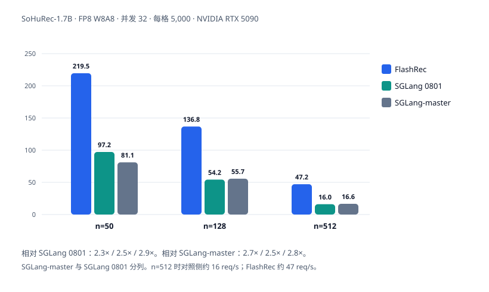
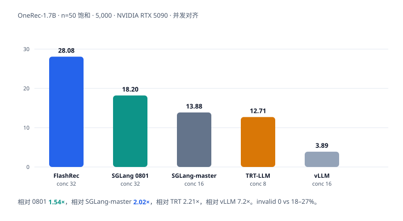

   

**[特性](#主要特性)** | **[快速开始](#快速开始)** | **文档** | **示例** | **架构** | **API** | **评测** | **FAQ** | **[English](README.md)**

**生成式推荐推理引擎（基于 mini-sglang）：在语义 ID 目录上执行宽 beam search，**  
**解码路径在 CUDA graph 内完成。**

---

生成式推荐（GenRec）将物品检索表示为语义 ID（SID）序列的生成。SID 为定长、浅层
的 token 序列，用于在物品目录中寻址。该任务的典型形态为解码深度 3–5 步、beam
宽度 50–512 及以上，且每一步的候选须属于合法 SID 集合。通用大语言模型推理引擎
面向长序列、单路径解码优化，宽 beam 请求难以与其他请求共享计算，吞吐随并发提升
有限。FlashRec 针对上述负载设计。





## 主要特性

面向短 SID 深度、宽 beam、目录约束解码。吞吐随 beam 宽度 `n` 与并发上升；非法
SID 率由 trie 约束保证为 0。评测结果见 [评测](#评测)。


|              | FlashRec          | 通用 LLM 引擎                            |
| ------------ | --------------------- | ------------------------------------ |
| 深度 / 宽度      | 3–5 步 × 50–512+ beam  | 数百～数千步 × 1 条序列                       |
| 词表           | 合法 SID 续写（trie）       | 全词表、无约束                              |
| 宽 beam graph | 含扩展步，按 `n` 的倍数捕获、一次重放 | 捕获常按 decode batch 定尺寸，宽 beam 走 eager |
| 非法 SID       | **0**                 | 约 17–27%，事后过滤                        |
| 并发           | beam 行槽位预算，不同请求共享同一步  | 一个宽 beam 请求占满引擎，吞吐对并发基本平坦            |


**解码**

- **CUDA graph。** beam 宽度 50–512 及以上的解码路径（含 beam 扩展）在捕获的
CUDA graph 内执行；捕获尺寸按配置宽度的整数倍选取，宽 beam 一次重放即可完成。
- **SID 约束。** 由融合 CUDA kernel（稠密或 CSR 稀疏 trie）将解码限制在合法语义
ID 目录内，`lm_head` 仅在 SID token 区间计算。非法 SID 不进入候选，
`invalid_rate` 为 0；开放词表基线的非法 beam 比例约为 17–27%。
- **调度。** 按 beam 行槽位预算在 decode 步之间准入请求，不同请求的 beam 行可在
同一步内批处理。前缀 KV cache 采用 radix 结构，调度策略为最长前缀匹配（LPM），
并以 aging 避免饥饿。

**服务**

- **同进程服务。** HTTP、调度、权重与 KV 池位于同一进程，共享地址空间。
- **默认 FP8。** W8A8 per-channel 权重与 `fp8_e4m3` KV cache，并融合
RMSNorm→FP8、SiLU→FP8、QK-RoPE+KV-write。1.7B 级 checkpoint 上 `n ≤ 128`
时主要降低权重与 KV cache 显存占用；`n = 512` 时与 BF16 吞吐接近，此时单步开销
以簿记为主。
- **接口。** `/v1/chat/completions` 按分数返回排序后的 beam。
`temperature = 0` 为确定性 top-*k*；大于 0 时为 Gumbel top-*k* 无放回采样。
- **剖析。** `/start_profile` / `/stop_profile` 与
`sglang.bench_serving --profile` 兼容。


## 快速开始

```bash
pip install -e .

# 文档示例使用的公开 GenRec checkpoint。
hf download OpenOneRec/OneRec-1.7B --local-dir ./OneRec-1.7B

# 从 OpenOneRec RecIF-Bench 的 benchmark_data 构建 SID catalog。
DATA_DIR=/path/to/OpenOneRec-RecIF/benchmark_data bash scripts/build_catalog.sh

# 启动服务并约束到该 catalog。SID 布局由 tokenizer 推断。
flashrec --serve --model-path ./OneRec-1.7B --port 8000 \
  --beam-width 32 --max-tokens 5 \
  --sid-vocab-file data/catalogs/sid2pid_beamrec_l4.json
```

```bash
curl -s http://127.0.0.1:8000/v1/chat/completions \
  -H 'Content-Type: application/json' \
  -d '{"messages":[{"role":"user","content":"..."}],
       "n":32,"max_tokens":5,"temperature":0}'
```

每条 beam 作为一个 `choices[]` 条目返回，按分数从优到劣排序，分数位于
`sglext.sequence_score`。传入 `--sid-vocab-file` 后，SID 布局由 checkpoint
tokenizer 推断。未指定 catalog 时在全词表上解码，仅用于通路验证。宽 beam
（`n ≥ 512`）需同时设置 `--cuda-graph-max-bs 4096 --batch-slots 4096`。

服务绑定 `127.0.0.1`，不提供认证。仅在可信网络内或经认证代理之后暴露公网地址。

离线与 HTTP 客户端见 [示例](examples/)；参数见 [参数](docs/configuration.zh-CN.md)。

## 评测

硬件为 **NVIDIA RTX 5090**。详见
[评测](docs/baselines.zh-CN.md)。除非另行说明，FlashRec 为 FP8 + SID trie，对照引擎为
开放词表。**SGLang-master**（[PR #31626](https://github.com/sgl-project/sglang/pull/31626)）
与 **SGLang 0801**（[`cswuyg/sglang` `feature/beam_search_update_0801`](https://github.com/cswuyg/sglang/tree/feature/beam_search_update_0801)）
分列，不要写成一行。

评测覆盖：

- **OneRec**：快手 [OpenOneRec](https://github.com/Kuaishou-OneRec/OpenOneRec)
RecIF-Bench video 任务，模型为
[OneRec-1.7B](https://huggingface.co/OpenOneRec/OneRec-1.7B)
- **SoHuRec-1.7B / SoHuRec-0.6B**：对应模型上的搜狐内部生成式推荐服务请求

加速比为 FlashRec 相对该对照框架。不要用 OneRec QPS 去除以 SoHuRec QPS（prompt
长度差约 8×）。


| 对照框架 | 设定 | 相对吞吐 |
| --- | --- | --- |
| **SGLang 0801** | OneRec，`n=50` 饱和 | **1.54×**（recall@32 均为 0.034；invalid 0 vs 0.270） |
| **SGLang-master** | OneRec，`n=50` 饱和 | **2.02×**（recall@32 均为 0.034；invalid 0 vs 0.260） |
| TensorRT-LLM | OneRec，`n=50` 饱和 | **2.21×** |
| vLLM | OneRec，`n=50` 饱和 | **7.2×** |
| **SGLang 0801** | SoHuRec-1.7B，`n=50–512` 饱和 | **2.3–3.0×** |
| **SGLang-master** | SoHuRec-1.7B，`n=50–512` 饱和 | **2.5–2.9×** |
| **SGLang 0801** | SoHuRec，`n=1000` 并发 1 | **2.1–2.2×**（conc ≥ 8 失败） |
| **SGLang-master** | SoHuRec，`n=1000` 并发 1 | **2.1–2.2×**（conc ≥ 8 失败） |


OneRec 上 FlashRec 的 `invalid_rate` 为 0；开放词表引擎约为 17–27%。质量差主要来自
**有没有 SID 约束**，不是引擎实现。**不要引用 FlashRec conc=1 的 recall@32**
（unique-beam 塌缩）。引用时请注明设备、是否启用 trie、并发与样本量。

### OneRec

[OpenOneRec](https://github.com/Kuaishou-OneRec/OpenOneRec) RecIF-Bench video，
模型 [OneRec-1.7B](https://huggingface.co/OpenOneRec/OneRec-1.7B)。5,000 条，
`n=50` 饱和（各引擎取最高已跑满并发）。


| 引擎 | 约束 | QPS | conc | recall@32（conc=8） | invalid |
| --- | --- | ---: | ---: | ---: | ---: |
| **FlashRec** | SID trie | **28.08** | 32 | 0.034 | **0** |
| SGLang 0801 | 开放词表 | 18.20 | 32 | 0.034 | 0.270 |
| SGLang-master | 开放词表 | 13.88 | 16 | 0.034 | 0.260 |
| TensorRT-LLM | 开放词表 | 12.71 | 8 | 0.034 | 0.259 |
| vLLM | 开放词表 | 3.89 | 16 | 0.034 | 0.260 |


相对 SGLang 0801 **1.54×**，相对 SGLang-master **2.02×**，相对 TensorRT-LLM **2.21×**，
相对 vLLM **7.2×**。`n=1000` FlashRec 饱和 **4.62 QPS**；SGLang-master 与 SGLang 0801 只能稳住
conc=1（2.5–3.0）。完整矩阵见 [评测](docs/baselines.zh-CN.md)。

SoHuRec 生产短 prompt：`n=50` 时 1.7B FlashRec 饱和 **220 QPS**，0.6B **303 QPS**；
`n=512` 时 1.7B **~48 QPS** vs 0801 / SGLang-master **~16 QPS**；`n=1000` FlashRec
饱和 **24.6 QPS**（1.7B）与 **32 QPS**（0.6B），SGLang-master 与 SGLang 0801 只能稳住 conc=1。

### 与 HuggingFace 的数值对齐

下列结果为 codebook 约束 beam（无 SID trie）相对 `transformers` 的数值对齐，
不是检索 recall。HuggingFace 为 BF16 参考；FlashRec 分别在 BF16 与 FP8 下
测量。详见 [评测](docs/baselines.zh-CN.md)；命令见 [示例](examples/README.md)。

- **OneRec-1.7B（RTX 5090）**：BF16 在 `n = 1–512` 上最优 SID 与 HuggingFace
一致，beam 集合重叠 **86–92%**。FP8 在 `n = 1` 因 0.125 nats 近并列交换
top-1；`n = 20` 重叠 **80%**，`n ≥ 50` 重叠 **70–76%**。HuggingFace 最优序列
自 `n = 20` 起已包含于 FlashRec 的 beam 集合。公开 checkpoint 未经 FP8
训练，该下降来自加载时量化，**不是框架问题**。
- **SoHuRec-1.7B / SoHuRec-0.6B（FP8 训练，RTX 5090，两侧 decoder GEMM 均为 FP8）**：
beam 集合重叠分别为 **88–96%** / **88–93%**；prefill top-1 在 SoHuRec-1.7B 为 100%、
SoHuRec-0.6B 为 94%（长尾 rank corr 0.641，集合重叠仍约 90%）。`n = 512` 为前 3 条
请求的均值（HuggingFace 在更长请求上显存不足）。生产路径建议使用 FP8 训练的
模型。


## 支持的模型

**Qwen3 dense**：Qwen3-0.6B / 1.7B / 4B / 8B / 14B、OneRec-1.7B、SoHuRec-1.7B /
SoHuRec-0.6B，以及基于 Qwen3 的 GenRec checkpoint。结构参数（GQA、`head_dim`、qk-norm、tied
embeddings）从 `config.json` 读取，已在 1.7B 规模验证。更广的 dense 与 MoE 覆盖
见 [路线图](#路线图)。

支持 BF16 checkpoint（默认 `--quantization fp8` 时加载即在线量化为 W8A8
per-channel）以及带 `weight_scale` 的预量化 FP8 checkpoint。`--quantization`
取其他值时以 BF16 运行。

模型规模受设备显存约束：32 GB 下 FP8 约可至 14B。序列长度由 `--max-seq-len`
（默认 4096）限制，并保持在 checkpoint 原生位置编码范围内。引擎提供语义 ID
目录上的 beam search 服务。

## 架构

请求在持有权重与 KV 池的同一进程内完成；HTTP、调度与模型共享同一地址空间。

模块布局参考 [mini-sglang](https://github.com/sgl-project/mini-sglang)，运行时
依赖 `sgl-kernel`、`flashinfer_python` 与 `triton`。请求路径、设计说明与模块
结构见 [架构](docs/architecture.md)。

## 文档

[文档](docs/README.zh-CN.md) · [架构](docs/architecture.md) ·
[API](docs/api.md) · [参数](docs/configuration.zh-CN.md) ·
[评测](docs/baselines.zh-CN.md) · [FAQ](docs/faq.md) ·
[示例](examples/) · [Changelog](CHANGELOG.md)

## 开发

每个 clone 安装一次 hook，之后每次 commit 自动运行，与 CI 检查一致：

```bash
pip install pre-commit && pre-commit install
pre-commit run --all-files     # 全量检查
```

单元测试在 CPU 上运行：

```bash
python -m pytest
```

与 SGLang beam 服务的在线对齐、与 HuggingFace `transformers` 的精度对比，以及
profiling / trace 接口，见 [参数](docs/configuration.zh-CN.md)。

```bash
# codebook 约束 vs HuggingFace（需要 CUDA + OneRec-1.7B）
FLASHREC_DIFF_MODEL=./OneRec-1.7B \
  PYTHONPATH=python python -m unittest tests.test_beam_search_diff -v

FLASHREC_DIFF_MODEL=./OneRec-1.7B \
FLASHREC_DIFF_BEAMS=1,20,50,128,512 \
FLASHREC_DIFF_QUANT=bf16 \
  PYTHONPATH=python python -m unittest tests.test_beam_search_diff.TestBeamSearchDiff -v
```

结果见 [与 HuggingFace 的数值对齐](#与-huggingface-的数值对齐)。
`FLASHREC_DIFF_QUANT=fp8`（默认）为服务路径。

## 路线图

- [ ] 扩展模型覆盖：Llama / Qwen / GLM 等 dense 结构，以及 Qwen3-MoE 等稀疏结构
- [ ] 张量并行与 expert 并行，以支持 30B–200B 量级 MoE 及更大规模 dense 推荐模型
- [ ] NVFP4 及 Blackwell 原生存储
- [ ] RecIF 全任务（video / ad / product）可复现评测，以及 PyPI 发布


## 贡献

欢迎提交 issue 和 pull request。开发环境、测试与提交流程见
[贡献指南](CONTRIBUTING.zh-CN.md)；社区行为准则见
[行为准则](CODE_OF_CONDUCT.md)。安全问题请按
[安全披露](SECURITY.md) 的私下披露流程报告。

## 致谢

- [SGLang](https://github.com/sgl-project/sglang)
- [mini-sglang](https://github.com/sgl-project/mini-sglang) —— 参照目录结构
- [OpenOneRec](https://github.com/Kuaishou-OneRec/OpenOneRec)（快手）—— OneRec-1.7B 与 RecIF-Bench
- [cswuyg/sglang](https://github.com/cswuyg/sglang/tree/feature/beam_search_update_0801) `feature/beam_search_update_0801` —— beam 语义对齐与精度测试来源


## 引用

```bibtex
@software{flashrec,
  title  = {FlashRec: A Wide-Beam Inference Engine for Generative Recommendation},
  author = {Wang, Chongyang and {sohu-mptc}},
  year   = {2026},
  url    = {https://github.com/sohu-mptc/FlashRec}
}
```

GitHub 的 Cite this repository 读取 [CITATION.cff](CITATION.cff)。

## License

Apache-2.0，见 [LICENSE](LICENSE)。